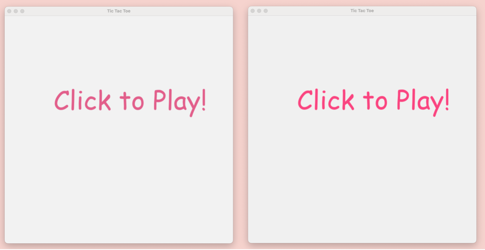
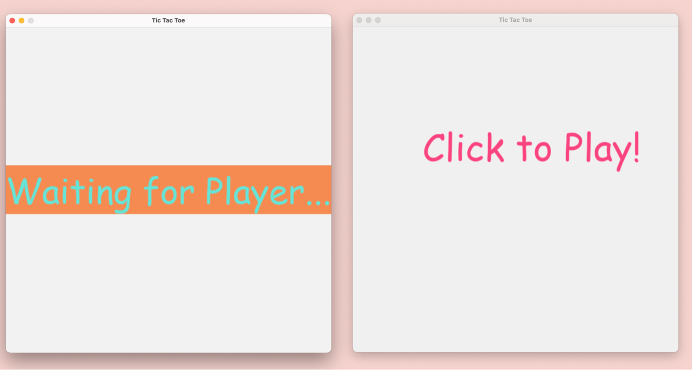
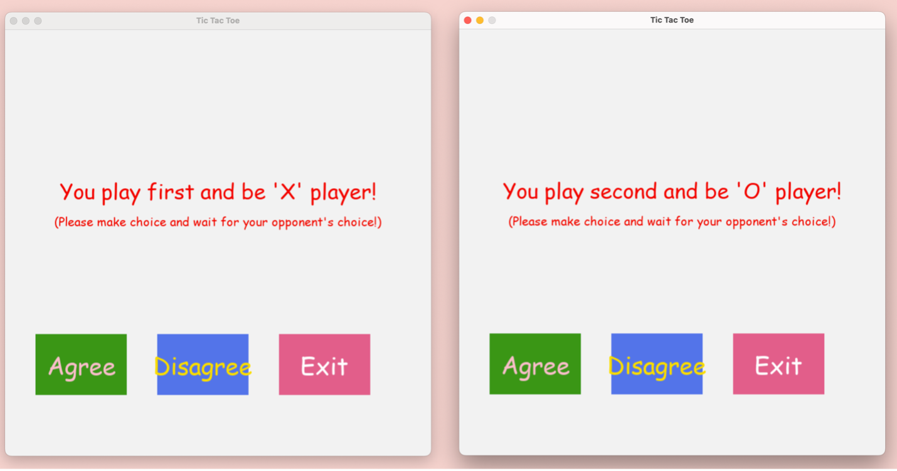
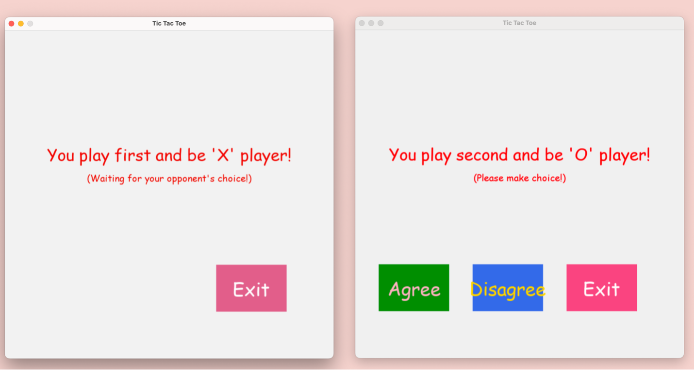
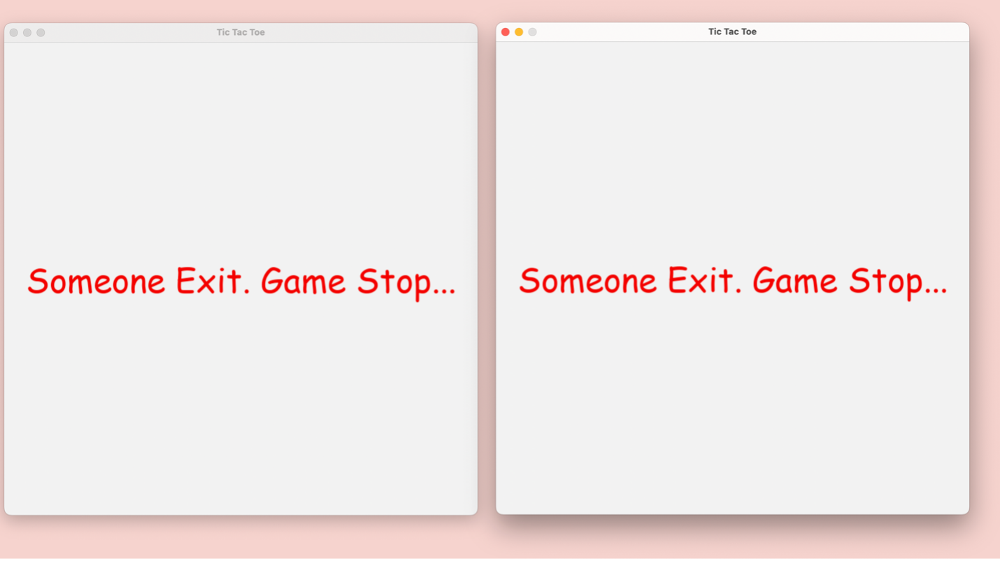
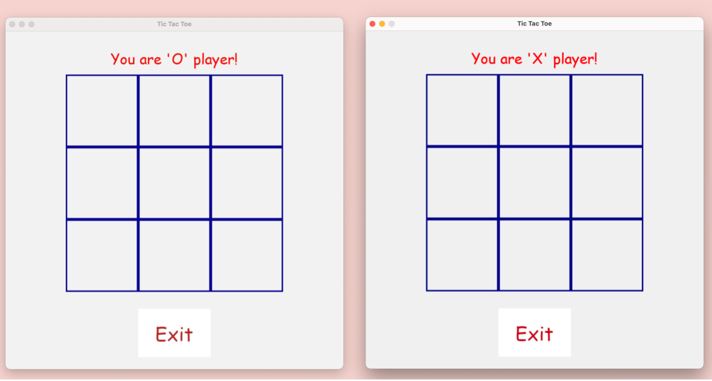
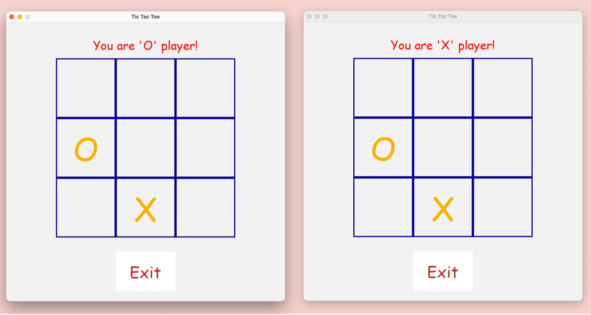
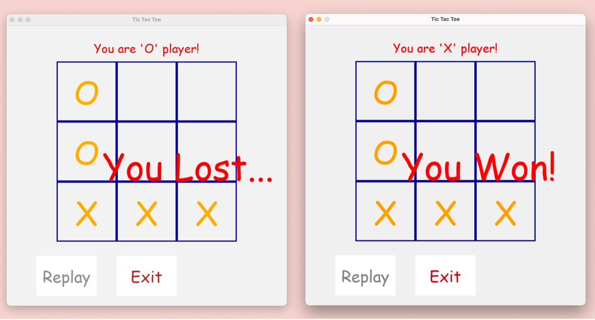
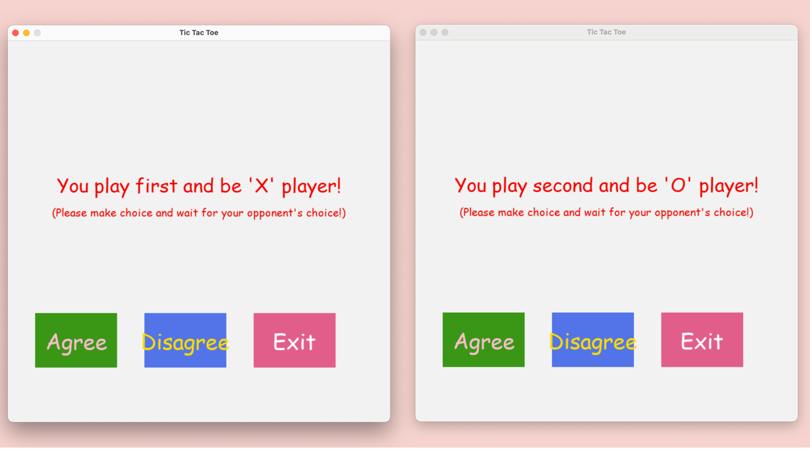

<h2>How to run the project:</h2>
<h4>In Linux/Mac:</h4>

Start server: ./ttt -s 5131(port number)

Start client1: ./ttt -c ip_address(hostname) 5131(port number)

Start client2: ./ttt -c ip_address(hostname) 5131(port number)

<h4>In Windows:</h4>

Change ttt to ttt.py(add suffix .py to ttt file)

Start server: python ttt.py -s 5131(port number)

Start client1: python ttt.py -c ip_address(hostname) 5131(port number)

Start client2: python ttt.py -c ip_address(hostname) 5131(port number)

<h2>Demo: </h2>
Demo vedio: [Watch my video on YouTube](https://www.youtube.com/watch?v=5jrJv4O6Dzw)

1.	Start two clients.
 
 
2.	One client click and wait for another player to connect the server. These two clients will be a pair to play the game.
 

3.	Two clients negotiate who will be “X” and who will be “O”. There is a default setting and reminder. Client should click “Agree” and “Disagree” button. 
Once client make a choice, buttons will disappear and wait another client’s decision.
If they choose both “Agree” or “Disagree” buttons, clients can begin playing game.
If one chooses “Agree” and another one chooses “Disagree” buttons, they should make choices again until they have same choices.
If someone click “Exit” button, both clients will exit the game.
 
 
 
 
4.	In the game board, it will remind the client of its role “X” or “O”, the empty board and the “Exit” button.
By default, “X” player starts the game first. Two clients click the board by turn.
 
 
 
5.	The game result will show in both client sides. There are three results: "You Won!", “You Lost...”, "Tie Game!".
If game is over, “Replay” button will show. 

 
6.	If someone clicks “Replay” button, it will enter the previous window where two clients negotiate who will be “X” and who will be “O” and make the choices.

7.	If someone clicks “Exit” button whether game is over or not, both clients will exit the game.
 

